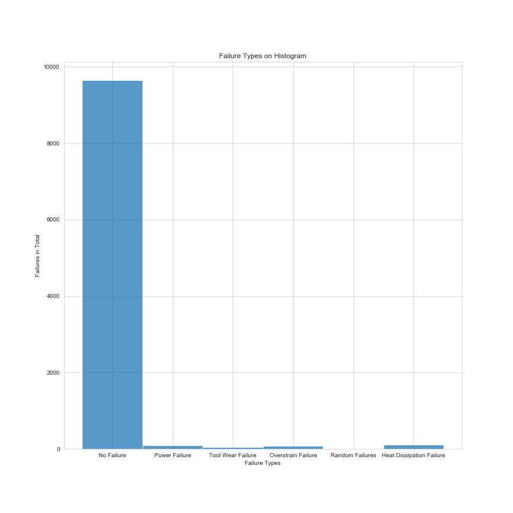
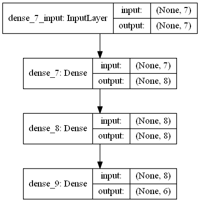
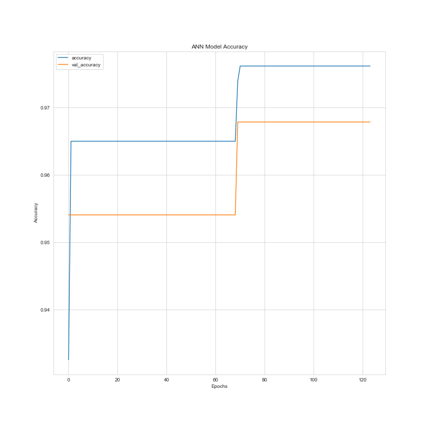
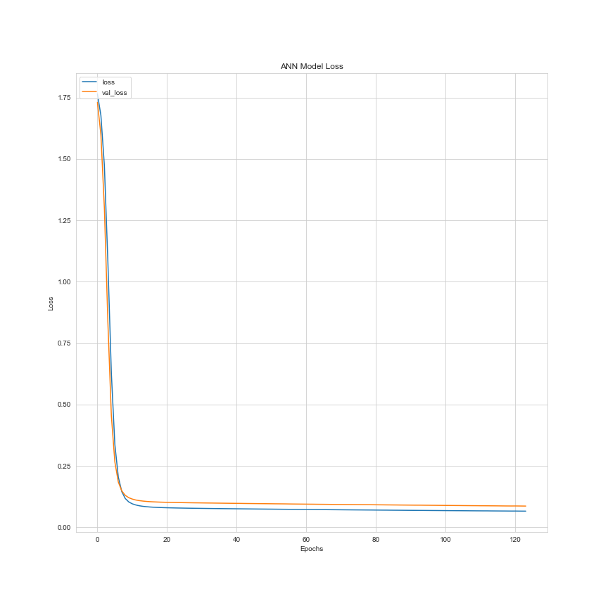

# Classify Failure Types with XGBoost and ANN

## Problem Statement

Since real predictive maintenance datasets are generally difficult to obtain and in particular difficult to publish, we present and provide a synthetic dataset that reflects real predictive maintenance encountered in the industry to the best of our knowledge. 

Soruce: 
- https://www.kaggle.com/shivamb/machine-predictive-maintenance-classification

The purpose of this study is based on the data, I want to classity and estimate maintenance failure types with XGBoost and artificial neural network. Output layer has 6 units. These are **No Failure, Heat Dissipation Failure, Power Failure, Overstrain Failure, Tool Wear Failure, Random Failures.**

## Dataset

Datasets are downloaded from [Kaggle](https://www.kaggle.com/shivamb/machine-predictive-maintenance-classification). You can find the details of the datasets in that website. **predictive_maintenance.csv** dataset has **10 columns** and **10000 rows without the header**. **Independent variables has 6 columns** (ID and Product_ID columnd dropped) and **depended variable has 1 column** which is Power Failure. 

| Column | Details |
|--|--|
| UID  | unique identifier ranging from 1 to 10000 |
| Product_ID | Consisting of a letter L, M, or H for low (50% of all products), medium (30%) and high (20%) as product quality variants and a variant-specific serial number |
| Air_temperature_[K] | generated using a random walk process later normalized to a standard deviation of 2 K around 300 K |
| Process_temperature_[K] | generated using a random walk process normalized to a standard deviation of 1 K, added to the air temperature plus 10 K. |
| Rotational_speed_[rpm] | calculated from powepower of 2860 W, overlaid with a normally distributed noise |
| Torque_[Nm] | torque values are normally distributed around 40 Nm with an σ = 10 Nm and no negative values. |
| Tool_wear_[min] | The quality variants H/M/L add 5/3/2 minutes of tool wear to the used tool in the process. |
| Failure_Type | No Failure, Heat Dissipation Failure, Power Failure, Overstrain Failure, Tool Wear Failure, Random Failures. |

Soruce: 
 - Stephan Matzka, School of Engineering - Technology and Life, Hochschule für Technik und Wirtschaft Berlin, 12459 Berlin, Germany, stephan.matzka@htw-berlin.de

## Methodology

In this project, as stated in the title, results were obtained through **XGBoost** and **artificial neural networks** methods. Our output has more than 1 units so I used ***sparse_categorical_crossentropy*** loss function.

## Analysis

| # | Column | Non-Null Count | Dtype |
|--|--|--|--|
| 0 | Type | 10000 non-null | int32
| 1 | Air_temperature_[K] | 10000 non-null | int64
| 2 | Process_temperature_[K] | 10000 non-null | int64
| 3 | Rotational_speed_[rpm] | 10000 non-null | int64
| 4 | Torque_[Nm] | 10000 non-null | int64
| 5 | Tool_wear_[min] | 10000 non-null | int64
| 6 | Target | 10000 non-null | int64
| 7 | Failure_Type | 10000 non-null | int32

dtypes: int32(2), int64(6) - memory usage: 547.0 KB

### Numbers of Failure Types in Overall

No Failure                  9652

Heat Dissipation Failure     112

Power Failure                 95

Overstrain Failure            78

Tool Wear Failure             45

Random Failures               18

     

### Artificial Neural Network

The keras model was created as indicated in the image above. Since the model output is binary, the **sparse_categorical_crossentropy** loss function is used. The model is saved as **model.h5**. When necessary, you can operate this model without the need for re-fit.

     

During the fit of the model, the validation probability and the validation loss graph were formed as follows.

| Validaton Accuracy | Validation Loss |
|--|--|
|  |  |

### XGBoost

#### Confusion Matrix of XGBoost
| 32 | 1 | 0 | 0 | 0 | 0 |
|--|--|--|--|--|--|
| **0** | **3194** | **0** | **1** | **5** | **0** |
| **0** | **1** | **25** | **0** | **0** | **1** |
| **0** | **0** | **4** | **25** | **0** | **1** |
| **0** | **0** | **0** | **0** | **0** | **0** |
| **0** | **0** | **0** | **0** | **0** | **10** |

**Accuracy score(XGBoost): 0.9957575757575757**

Process took 6.443553924560547 seconds.

## How to Run Code

Before running the code make sure that you have these libraries:

 - pandas 
 - time
 - sklearn
 - seaborn
 - warnings
 - xgboost
 - matplotlib
 - keras
    
## Contact Me

If you have something to say to me please contact me: 

 - Twitter: [Doguilmak](https://twitter.com/Doguilmak)  
 - Mail address: doguilmak@gmail.com
 